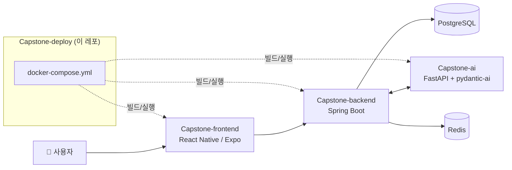

# 🚀 마실 (Masil) - 배포 가이드

> **대화형 실시간 정보 기반 여행 일정 생성 및 예약 서비스**

**마실**은 정적이고 파편화된 기존 여행 정보 서비스의 한계와 생성형 AI의 환각(Hallucination) 문제를 극복하기 위한 서비스로, 정보 탐색부터 일정 계획, 실제 예약까지 하나의 대화형 인터페이스 안에서 끝맺는 것을 목표로 합니다.

이 레포는 마실을 구성하는 3개 서비스(Frontend, Backend, AI)를 Docker Compose로 한번에 묶어 실행하기 위한 **배포 구성 레포지토리**입니다. EC2 배포를 염두에 두고 작성되었으나, 실제로는 **로컬 환경에서 `docker compose up`으로 통합 실행만 검증**했고 EC2에 올려서 운영해본 적은 없습니다. 아래 EC2 관련 절차는 검증되지 않은 가이드로 참고하세요.

---

## 🏗 시스템 아키텍처



---

## 👥 팀 (4조 · 여울)

명지대학교 컴퓨터공학전공 캡스톤디자인 (지도교수: 안희철)

| | 역할 | 이름 | GitHub |
| :---: | :--- | :--- | :--- |
|  | 팀장 | 박지후 | [@thisisjihoo](https://github.com/thisisjihoo) |
|  | 팀원 | 임채현 | [@Chaehyunli](https://github.com/Chaehyunli) |
|  | 팀원 | 김한슬 | [@hanseul377](https://github.com/hanseul377) |
|  | 팀원 | 남서현 | [@DOOYEE0709](https://github.com/DOOYEE0709) |

---

## 📁 레포 구조

```
capstone-deploy/
├── docker-compose.yml      # 전체 서비스 실행 설정
├── frontend.env.example    # 프론트엔드 환경변수 예시
├── backend.env.example     # 백엔드 환경변수 예시
├── ai.env.example          # AI 서버 환경변수 예시
└── .gitignore              # *.env 파일 git 추적 제외
```

> `*.env` 파일은 git에 올라가지 않습니다. 서버에서 직접 생성해야 합니다.

---

## 🖥️ EC2 서버 초기 설정

> 최초 1회만 진행합니다.

### 1. Docker 설치

```bash
sudo apt update
sudo apt install -y docker.io docker-compose-plugin

# 현재 사용자에게 Docker 권한 부여 (재로그인 필요)
sudo usermod -aG docker $USER
exit
# SSH 재접속 후 아래 명령어로 확인
docker --version
docker compose version
```

### 2. 레포 4개 Clone

```bash
git clone https://github.com/MjuCapstone2026/Capstone-frontend.git
git clone https://github.com/MjuCapstone2026/Capstone-backend.git
git clone https://github.com/MjuCapstone2026/Capstone-ai.git
git clone https://github.com/MjuCapstone2026/Capstone-deploy.git
```

> 4개의 폴더가 같은 경로에 나란히 있어야 합니다.
> ```
> ~/
> ├── Capstone-frontend/
> ├── Capstone-backend/
> ├── Capstone-ai/
> └── Capstone-deploy/
> ```

---

## 🔑 환경변수 설정

```bash
cd capstone-deploy

cp frontend.env.example frontend.env
cp backend.env.example backend.env
cp ai.env.example ai.env
```

각 파일을 열어 실제 값을 채웁니다.

```bash
vi frontend.env   # EC2 퍼블릭 IP 또는 도메인, Clerk 키
vi backend.env    # DB, Redis, Clerk, AI 서버 주소 등
vi ai.env         # Gemini API 키, LangSmith 키 등
```

> **주의:** `backend.env`의 `AI_AGENT_URL`은 `http://ai:8000` 으로 설정합니다.
> (Docker 내부 네트워크에서 서비스명으로 통신)

---

## 🐳 초기 배포

```bash
cd capstone-deploy

# 전체 빌드 & 백그라운드 실행
docker compose up --build -d
```

### 실행 확인

```bash
# 컨테이너 상태 확인
docker compose ps

# 로그 확인 (전체)
docker compose logs

# 서비스별 로그 확인
docker compose logs frontend
docker compose logs backend
docker compose logs ai
```

### 접속 주소

| 서비스 | 주소 |
|--------|------|
| Frontend | `http://<EC2 퍼블릭 IP>` |
| Backend Swagger | `http://<EC2 퍼블릭 IP>:8080/swagger-ui/index.html` |
| AI Swagger | `http://<EC2 퍼블릭 IP>:8000/docs` |

---

## 🔄 재배포 (코드 업데이트)

### 특정 서비스만 업데이트

```bash
# 1. 해당 레포에서 최신 코드 받기
cd ../capstone-backend
git pull

# 2. capstone-deploy로 돌아와서 해당 서비스만 재빌드
cd ../capstone-deploy
docker compose up --build -d backend
```

### 전체 서비스 업데이트

```bash
cd ../capstone-frontend && git pull
cd ../capstone-backend && git pull
cd ../capstone-ai && git pull

cd ../capstone-deploy
docker compose up --build -d
```

> 재빌드 시 다른 서비스는 중단 없이 유지됩니다.

---

## 🛑 서비스 중지 / 재시작

```bash
# 전체 중지
docker compose down

# 전체 재시작 (재빌드 없이)
docker compose restart

# 특정 서비스 재시작
docker compose restart backend
```

---

## 🧹 디스크 정리

배포를 반복하면 사용하지 않는 이미지가 쌓입니다. 주기적으로 정리하세요.

```bash
# 사용하지 않는 이미지/컨테이너 정리
docker system prune -f
```

---

## ❗ 트러블슈팅

### 컨테이너가 바로 종료될 때

```bash
# 해당 서비스 로그 확인
docker compose logs backend
```

### 환경변수가 적용 안 될 때

`.env` 파일 수정 후 반드시 재빌드가 필요합니다.

```bash
docker compose up --build -d
```

### 포트가 이미 사용 중일 때

```bash
sudo lsof -i :8080
sudo kill -9 <PID>
```

---

## 🔗 관련 레포

| 레포 | 설명 |
| :--- | :--- |
| [Capstone-frontend](https://github.com/MjuCapstone2026/Capstone-frontend) | 모바일 앱 (React Native / Expo) |
| [Capstone-backend](https://github.com/MjuCapstone2026/Capstone-backend) | 메인 API 서버 (Spring Boot) |
| [Capstone-ai](https://github.com/MjuCapstone2026/Capstone-ai) | AI 에이전트 서버 (FastAPI) |
| [MjuCapstone2026](https://github.com/MjuCapstone2026) | 조직 홈 |
